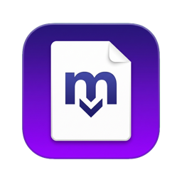
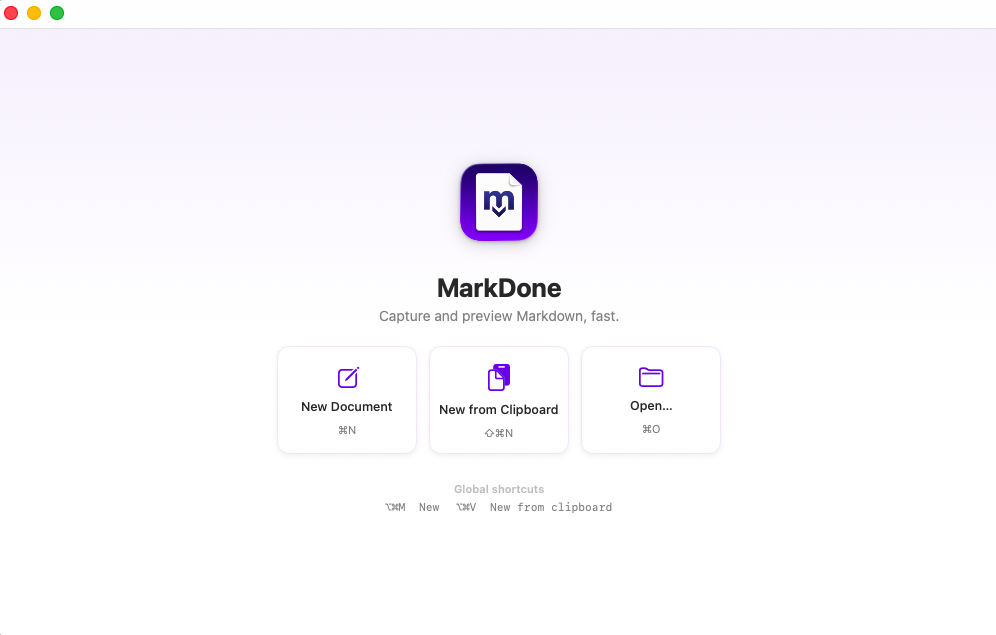

<p align="center">
  
</p>

<h1 align="center">MarkDone</h1>

<p align="center">
  <a href="LICENSE"></a>
  <a href="#install"></a>
  <a href="https://github.com/bholdman/markdone/releases/latest"></a>
</p>

A fast, native macOS app for capturing, previewing, and lightly editing Markdown. Built with SwiftUI + AppKit, fully offline, and small enough to leave running all day.

Designed around two workflows:
1. **Zero-friction capture** — summon an empty document (or one pre-filled from your clipboard) with a global hotkey, paste, and save.
2. **Live preview** — a split editor/preview pane that renders GitHub-flavored Markdown as you type, with both panes kept in sync.

MarkDone also registers as the **default app for `.md` files**, so double-clicking a Markdown file in Finder opens it in a new tab.

<p align="center">
  
</p>

## Why this exists

The more I worked with AI tools, the more Markdown I was pasting around, and the more I wanted a Markdown editor and previewer that was lightweight and worked the way I do. I tried several. They were good, but there was always something I had to adapt to, or they were heavier and pricier than the job called for. So I had AI build one.

I have no SwiftUI experience. The code in this repo is **100% AI-written**, with the direction, planning, testing, and product decisions coming from a human. It turned out to be exactly the tool I wanted, so it's here for anyone else who wants it. Use it, fork it, open issues, send pull requests. See [CONTRIBUTING.md](CONTRIBUTING.md) to get started.

## Shortcuts

| Action | Shortcut | Scope |
|--------|----------|-------|
| New empty document | ⌥⌘M | Global (works from any app) |
| New from clipboard | ⌥⌘V | Global (works from any app) |
| New / New Tab | ⌘N / ⌘T | In app |
| New from clipboard | ⇧⌘N | In app |
| Open… | ⌘O | In app |
| Close Tab | ⌘W | In app |
| Next / Previous Tab | ⇧⌘] / ⇧⌘[ | In app |
| Save / Save As… | ⌘S / ⇧⌘S | In app |
| Editor / Split / Preview | ⌘1 / ⌘2 / ⌘3 | In app |

There's also a menu bar icon: click it to show MarkDone, right-click it for the same quick actions. The app stays resident in the menu bar after you close the window, so the icon and global hotkeys keep working.

## Features

### Capture
- Menu bar icon (click to show, right-click for actions) + system-wide hotkeys (Carbon Hot Key API — no Accessibility permission needed)
- "New from clipboard" for the paste-and-go workflow
- Welcome screen with quick actions when no document is open
- Smart Save: suggests a filename from the first `# heading`
- Unsaved-changes guard when closing a dirty tab

### Tabs & files
- **Tabs** — open and work with multiple documents at once; dirty tabs show a dot
- **Default Markdown handler** — declares `net.daringfireball.markdown` as Owner, so MarkDone becomes the default app for `.md`, `.markdown`, `.mdown`, `.mkd`, `.mkdn`, `.mdwn`, `.markdn`, and `.mdtext` (plain-text files as an alternate)
- Open from Finder (double-click, "Open With", Dock drop) — files opened at cold launch replace the initial empty tab
- **Drag and drop** a file anywhere in the window — editor, preview, tab bar, or welcome screen — to open it in a new tab

### Editor & preview
- Split-pane live preview with GitHub-flavored Markdown: tables, task lists, fenced code with syntax highlighting
- Editor-only / split / preview-only view modes
- **Two-way scroll sync** between editor and preview
- **Selection sync** — select text in the editor and the matching rendered text highlights in the preview; select in the preview and the source selects in the editor
- **Edit in the preview** — the rendered view is editable; changes are converted back to Markdown (via Turndown) and written into the source
- Monospaced editor with smart substitutions (quotes, dashes, autocorrect) turned off
- Status bar with file path, word / character count, and view switcher
- Follows system light/dark appearance (including the preview and code theme); violet accent matching the app icon
- Fully offline — `marked`, `highlight.js`, `turndown`, and CSS are bundled and **inlined** into the preview

## Install

Download the latest `.dmg` from the [Releases page](https://github.com/bholdman/markdone/releases/latest), open it, and drag MarkDone to Applications. Builds are signed and notarized, so there's no Gatekeeper prompt.

On first launch MarkDone opens an empty document and adds an icon to the menu bar. Closing the window leaves the app running in the menu bar; click the icon or press a hotkey to bring it back. Quit from the icon's right-click menu or with ⌘Q.

To make MarkDone the default app for Markdown files, right-click any `.md` file in Finder, choose **Get Info → Open with → MarkDone**, then **Change All…**. (On a fresh Mac with no other Markdown app installed, it becomes the default automatically.)

Requires macOS 14 or later.

## Build & Run

Requires Xcode.

```sh
xcodebuild -project MarkDone.xcodeproj -scheme MarkDone -configuration Debug -derivedDataPath build
open build/Build/Products/Debug/MarkDone.app
```

Or just open `MarkDone.xcodeproj` in Xcode and press ⌘R.

To produce a signed, notarized release (`.dmg` + `.zip` in `dist/`), see [RELEASING.md](RELEASING.md).

## Project layout

```
MarkDone/
  MarkDoneApp.swift      App entry, window, menus, menu bar, hotkeys, file-open handling
  Theme.swift            Shared visual constants
  Document.swift         Per-document (per-tab) model
  DocumentStore.swift    Tab management + open/save/new/close logic
  HotKeyManager.swift    Global hotkeys via Carbon
  SyncModel.swift        Scroll/selection sync between editor and preview
  RootView.swift         Tab bar + editor pane + status bar (+ welcome screen, file drop)
  TabBarView.swift       Custom browser-style tab strip
  EditorPane.swift       Editor/preview split for the active document
  CodeEditorView.swift   NSTextView-backed Markdown editor (accepts file drops)
  MarkdownWebView.swift  WKWebView preview: marked + highlight.js render, Turndown edits
  StatusBarView.swift    File path, word/char count, view-mode switcher
  Info.plist             Partial plist: Markdown document type + UTI declaration
  MarkDone.entitlements  Sandbox, user-selected files, network client (needed for WebKit)
  Assets.xcassets/       AppIcon, MenubarIcon (template), AccentColor
  Resources/             marked, highlight.js, turndown (+ GFM plugin), CSS
examples/
  sample.md              A document exercising tables, task lists, code, quotes
scripts/
  genproj.py             Generates MarkDone.xcodeproj (source of truth for build settings)
  package.sh             Release build → Developer ID sign → notarize → staple → dmg/zip
  maketemplate.swift     Converts menu-bar source art into a monochrome template icon
art/                     Icon source PNGs, README logo, and screenshots
```

The Xcode project is generated by `scripts/genproj.py` — when adding or removing source files, or changing the version (`MARKETING_VERSION`), update the script and regenerate rather than hand-editing `project.pbxproj`.

### Implementation notes

- **Preview rendering in the sandbox** needs two things together: assets inlined into a single HTML string loaded via `loadHTMLString`, *and* the `com.apple.security.network.client` entitlement (without it the WebKit networking service can't launch and the preview stays blank).
- **Pane sync** uses direct closures rather than `@Published` state so a stream of scroll events doesn't re-render the view hierarchy.
- **Selection sync** matches whitespace-flexibly between Markdown source and rendered text; the preview highlight uses the CSS Custom Highlight API so it's visible even when the preview isn't focused. Selections crossing inline formatting mid-run may occasionally mis-map.
- **Preview edits** round-trip through Turndown, which normalizes formatting (e.g. `*` → `-` bullets, ATX headings, fenced code).

## Icons

`art/appicon-source.png` and `art/menubar-source.png` are the source images.
The app icon set and the (tint-able template) menu-bar icon live in
`MarkDone/Assets.xcassets`. To regenerate from new source art, re-run the
`sips` app-icon commands and the `scripts/maketemplate.swift` menu-bar processor.

## Roadmap ideas

None of these are built yet. If one of them scratches your itch, open an issue and say so, or send a PR.

- Persistent scratch buffer (never lose an unsaved paste)
- Export to PDF / copy rendered HTML or rich text
- Mermaid diagrams + KaTeX math in preview
- Configurable default save folder (e.g. an Obsidian vault) with one-key save
- Drag-in images auto-saved with relative links
- Recent files menu, reading time
- Drag-to-reorder tabs

## Contributing

Bug reports, feature ideas, and pull requests are all welcome. Read [CONTRIBUTING.md](CONTRIBUTING.md) for the development setup, the one thing you must know about the generated Xcode project, and a short list of things that are easy to break.

## License

[MIT](LICENSE) © 2026 Brian Holdman. Bundled third-party libraries ([marked](https://github.com/markedjs/marked), [highlight.js](https://github.com/highlightjs/highlight.js), [Turndown](https://github.com/mixmark-io/turndown), [github-markdown-css](https://github.com/sindresorhus/github-markdown-css)) are under their own licenses (MIT, and BSD-3-Clause for highlight.js).
